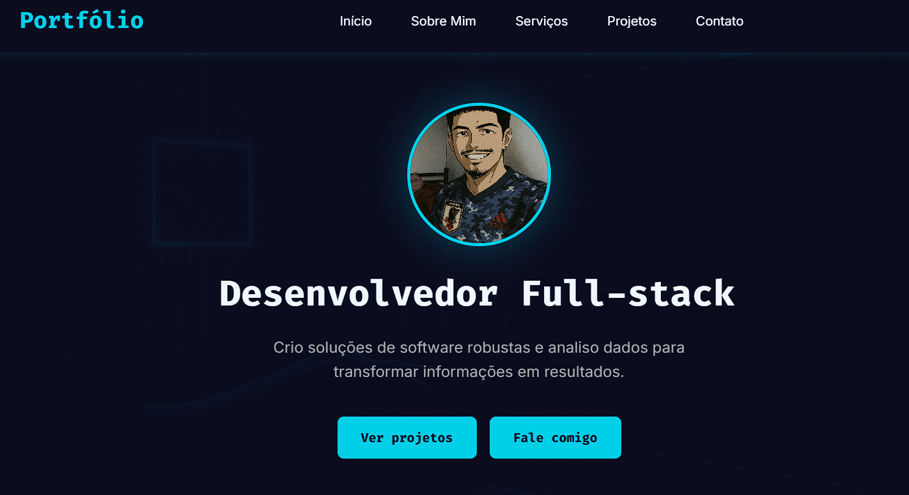

# 🌐 Portfólio Pessoal - Márcio Lucas

Bem-vindo ao meu portfólio! Este projeto foi desenvolvido para apresentar meus principais projetos, habilidades e trajetória como desenvolvedor **Full-Stack Java**. O site é totalmente responsivo e inclui **modo claro/escuro** para melhor experiência do usuário.

🔗 Acesse: [marcioluca.github.io/portifolio-mlucas](https://marcioluca.github.io/portifolio-mlucas)

---

## 👨‍💻 Sobre mim

Sou estudante de **Análise e Desenvolvimento de Sistemas** e desenvolvedor com foco em **Back-End Java**. Gosto de criar soluções funcionais e acessíveis, além de estudar constantemente boas práticas, tecnologias modernas e estruturação de código limpo.

---

## 🛠️ Tecnologias

- **HTML5** – Estrutura semântica
- **CSS3** – Estilização customizada e responsiva
- **JavaScript** – Lógica do modo dark/light e interações
- **Git & GitHub** – Versionamento e deploy via GitHub Pages

---

## 💡 Funcionalidades

- 📱 **Design responsivo** (mobile-first)
- 🌗 Alternância entre **tema claro e escuro**
- 📄 Seções bem definidas: *Sobre, Projetos, Habilidades e Contato*
- 📂 Código limpo e organizado

---

## 🖼️ Preview



---

## 🚀 Como rodar localmente

Clone o repositório e abra o arquivo `index.html`:

```bash
git clone https://github.com/marcioluca/portifolio-mlucas.git
cd portifolio-mlucas
start index.html
